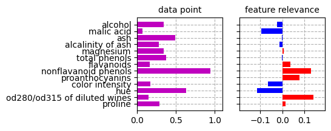

# Explaining K-Means with NEON
This demo demonstrates the NEON approach for explaining K-Means clustering predictions. The method is fully described in

<blockquote>
Kauffmann, J., Esders, M., Ruff, L., Montavon, G., Samek, W., & Müller, K.-R.<br><a href="https://arxiv.org/abs/1906.07633v2">From clustering to cluster explanations via neural networks</a><br><font color="#008800">arXiv:1906.07633v2, 2021</font>
</blockquote>


```python
from kmeans import KMeans
from neon import NeuralizedKMeans, neon
from utils import *
```

## Loading the data
First, we load the dataset and normalize the data to a reasonable range.


```python
wine = load_wine()
X, ytrue = wine['data'], tr.tensor(wine['target'])
feature_names = wine['feature_names']

X = MinMaxScaler().fit_transform(X)
X = tr.from_numpy(X)
```

## Training the K-Means model
Then, we train a K-Means model.


```python
# random state for reproducibility
m = KMeans(n_clusters=3, random_state=77)
m.fit(X)
```

The cluster assignments and true labels can be visualized in a 2D PCA embedding.


```python
# find best match between clusters and classes
y = m.decision(X)
C = contingency_matrix(ytrue, y)
_, best_match = linear_sum_assignment(-C.T)
y = tr.tensor([best_match[i] for i in y])

# compute a PCA embedding for visualization
pca = PCA(n_components=2).fit(X)
Z = pca.transform(X)

plt.title('wine clustering --- facecolor: clusters, edgecolor: classes')
plt.scatter(Z[:,0], Z[:,1], facecolor=cmap(2*y.numpy() + 1), edgecolor=cmap(2*ytrue.numpy()), alpha=.5)
plt.gca().set_aspect('equal')
plt.xticks([]), plt.yticks([])
plt.show()
```


    

    


## Neuralizing the model

The decision function for a cluster can be recoved as

This function contrasts distance to cluster *c* against distance to the nearest competitor.


```python
logits = m(X)
```

As shown in the original paper, the logit can be transformed to a neural network with identical outputs. The layers can be described as


```python
m = NeuralizedKMeans(m)

# check if all outputs are exactly the same with the neuralized model
assert tr.isclose(logits, m(X)).all(), "Predictions are not equal!"
```

## Explaining the cluster assignment

The neuralized model can be explained with Layer-wise Relevance Propagation (LRP). Here, we use the midpoint-rule in the first layer as described in the paper.


with *R<sub>i</sub>* the relevance of input variable *x<sub>i</sub>*. The hyperparameter 𝛽 controls the contribution of other competitors to the explanation. The main purpose is to disambiguate the explanation when more than one competitor is close to the min in layer 2.


```python
R = neon(m, X, beta=1)
```

The explanations can be visualized similarly to the inputs, e.g. in a barplot.
Here, we show an explanation for all misclassified points.

Note that points near the decision boundary (with probability close to 0.5) have low ambiguity regarding the nearest competitors, hence 𝛽 has little effect.


```python
I = tr.nonzero(y != ytrue)[:,0]
for i in I:
    logit = logits[i]
    prob = 1 / (1 + tr.exp(-logit))

    print('data point %d'%i)
    print('  cluster assignment: %d (probability %.2f)'%(y[i],prob))
    print('  true class        : %d'%ytrue[i])
    print('  sum(R) / logit    : %.4f / %.4f'%(sum(R[i]), logit))
    plot_explanation(X[i], R[i], feature_names, vlim=abs(R[I]).max()*1.1)
    plt.show()
    print('-'*80)
```

    data point 60
      cluster assignment: 2 (probability 0.52)
      true class        : 1
      sum(R) / logit    : 0.0772 / 0.0772


    

    


    --------------------------------------------------------------------------------
    data point 61
      cluster assignment: 2 (probability 0.56)
      true class        : 1
      sum(R) / logit    : 0.2447 / 0.2447


    

    


    --------------------------------------------------------------------------------
    data point 68
      cluster assignment: 2 (probability 0.52)
      true class        : 1
      sum(R) / logit    : 0.0800 / 0.0800


    

    


    --------------------------------------------------------------------------------
    data point 70
      cluster assignment: 2 (probability 0.52)
      true class        : 1
      sum(R) / logit    : 0.0866 / 0.0866


    

    


    --------------------------------------------------------------------------------
    data point 73
      cluster assignment: 0 (probability 0.57)
      true class        : 1
      sum(R) / logit    : 0.2848 / 0.2848


    

    


    --------------------------------------------------------------------------------
    data point 83
      cluster assignment: 2 (probability 0.61)
      true class        : 1
      sum(R) / logit    : 0.4378 / 0.4378


    

    


    --------------------------------------------------------------------------------
    data point 92
      cluster assignment: 2 (probability 0.50)
      true class        : 1
      sum(R) / logit    : 0.0089 / 0.0089


    

    


    --------------------------------------------------------------------------------
    data point 95
      cluster assignment: 0 (probability 0.53)
      true class        : 1
      sum(R) / logit    : 0.1348 / 0.1348


    

    


    --------------------------------------------------------------------------------
    data point 118
      cluster assignment: 2 (probability 0.55)
      true class        : 1
      sum(R) / logit    : 0.2151 / 0.2151


    

    


    --------------------------------------------------------------------------------

